# 对象

## 原型

JavaScript 只有一种结构：对象。每个对象（object）都有一个私有属性指向另一个名为原型`prototype`的对象。原型对象也有一个自己的原型，层层向上直到一个对象的原型为 null。根据定义，null 没有原型，并作为这个原型链`prototype chain`中的最后一个环节。

## 隐式原型
`__proto__` 是一个内置属性，它指向构造函数的原型。`__proto__` 并不是一个对象，而是由 JavaScript 引擎自动添加的。


```js | pure
// 中所有的对象都有一个内置属性，称为它的 prototype
function Person(name, age) {
  this.age = age
  this.name = name
}
// 通过 new 关键字创建构造函数的实例
const person = new Person('张三', 18);
// __proto__ 是一个内置属性，它指向构造函数的原型
console.log(person.__proto__ === Person.prototype); // true
```


构造函数有 `prototype` 箭头函数不会有 `prototype` 属性。

```js | pure

function Person(name, age) {
  this.age = age
  this.name = name
}
console.log(Person.prototype) // {}


const child = () => {}
console.log(child.prototype) // {undefined}

```


函数是一个可调用对象，构造函数也是函数，所以函数也是对象。

对象 call apply bind 方法都是从 Function 继承得到。


```js


function Person(name, age) {
  this.age = age
  this.name = name
}

console.log(Function.prototype === Person.__proto__)

```

## 关系

    构造函数 ----------------------> prototype
    构造函数 -------- new ---------> 实例
    实例     --- \_\_proto\_\_ ---> 构造函数 prototype
    根据 prototype 关系，可以推导出实例的原型是构造函数的 prototype。



