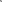

# 光线

添加一个光线到场景种


在一个基本场景的基础上，我们调整一下相机的设置。将 fov 设置为 45， far 设置为 100，然后移动相机位置到 (0, 10, 20)。


```diff
const fov = 45;
const aspect = 2;  // canvas 的默认宽高 300:150
const near = 0.1;
const far = 100;
const camera = new THREE.PerspectiveCamera(fov, aspect, near, far);
+ camera.position.set(0, 10, 20);
```

然后我们添加一个 OrbitControls。OrbitControls 让我们可以围绕某一个点旋转控制相机。OrbitControls 是 three.js 的可选模块，所以我们首先需要引入这个模块。

```diff
import * as THREE from 'three';
+ import {OrbitControls} from 'three/addons/controls/OrbitControls.js';
```

然后我们就可以使用了。创建 OrbitControls 时传入两个参数，一个是要控制的相机对象，第二个是检测事件的 DOM 元素。

```js
const controls = new OrbitControls(camera, canvas);
controls.target.set(0, 5, 0);
controls.update();
```

我们还将 OrbitControls 的观察点设置为 (0, 5, 0) 的位置，设置完需要调用一下 controls.update，这样才真正更新观察点位置。

下面我们创建一些东西来打光。首先，创建一个地平面，并用下方展示的 2x2 像素的黑白格图片来作为纹理。

<!--  -->


首先加载这个纹理，设置重复模式（wrapS, wrapT），采样模式（magFilter）以及重复的次数。因为贴图是 2x2 大小，通过设置成平铺模式，并且重复次数是边长的一半，就可以让每个格子正好是1个单位的大小。


```js
const planeSize = 40;
const loader = new THREE.TextureLoader();
const texture = loader.load('resources/images/checker.png');
texture.wrapS = THREE.RepeatWrapping;
texture.wrapT = THREE.RepeatWrapping;
texture.magFilter = THREE.NearestFilter;
texture.colorSpace = THREE.SRGBColorSpace;
const repeats = planeSize / 2;
texture.repeat.set(repeats, repeats);
```


接着我们创建一个平面几何体，一个材质，再用这两个作为参数，创建一个 Mesh 对象并且添加到场景中。因为创建的平面默认是在 XY 平面上（竖直平面），我们希望得到一个 XZ 平面（水平平面），所以我们将他旋转 90°。

```js
const planeGeo = new THREE.PlaneGeometry(planeSize, planeSize);
const planeMat = new THREE.MeshPhongMaterial({
  map: texture,
  side: THREE.DoubleSide,
});
const mesh = new THREE.Mesh(planeGeo, planeMat);
mesh.rotation.x = Math.PI * -.5;
scene.add(mesh);
```


接着再添加一个立方体和一个球体，这样我们就有三个物体可以打光。

```js

{
  const cubeSize = 4;
  const cubeGeo = new THREE.BoxGeometry(cubeSize, cubeSize, cubeSize);
  const cubeMat = new THREE.MeshPhongMaterial({color: '#8AC'});
  const mesh = new THREE.Mesh(cubeGeo, cubeMat);
  mesh.position.set(cubeSize + 1, cubeSize / 2, 0);
  scene.add(mesh);
}
{
  const sphereRadius = 3;
  const sphereWidthDivisions = 32;
  const sphereHeightDivisions = 16;
  const sphereGeo = new THREE.SphereGeometry(sphereRadius, sphereWidthDivisions, sphereHeightDivisions);
  const sphereMat = new THREE.MeshPhongMaterial({color: '#CA8'});
  const mesh = new THREE.Mesh(sphereGeo, sphereMat);
  mesh.position.set(-sphereRadius - 1, sphereRadius + 2, 0);
  scene.add(mesh);
}
```

一切准备就绪，我们开始添加光源。

## 环境光（AmbientLight）

```js
const color = 0xFFFFFF;
const intensity = 1;
const light = new THREE.AmbientLight(color, intensity);
scene.add(light);
```

添加一些控制代码，使我们可以动态地改变光照的参数，还是使用 lil-gui 来实现。为了可以通过 lil-gui 调节颜色，我们创建一个辅助对象。对象内有一个 getter 和 setter，当 lil-gui 从对象内获取 value 值的时候，触发了 getter，会根据创建对象实例时传入的 object 和 prop，返回一个十六进制色值的字符串，当通过 lil-gui 控制改变这个 value 的时候，就触发了 setter，会用十六进制的色值字符串作为参数调用 object.prop.set。

以下是 helper 类的代码：

```js
class ColorGUIHelper {
  constructor(object, prop) {
    this.object = object;
    this.prop = prop;
  }
  get value() {
    return `#${this.object[this.prop].getHexString()}`;
  }
  set value(hexString) {
    this.object[this.prop].set(hexString);
  }
}
```

以及创建 lil-gui 的代码：

```js
const gui = new GUI();
gui.addColor(new ColorGUIHelper(light, 'color'), 'value').name('color');
gui.add(light, 'intensity', 0, 2, 0.01);
```


<code src="./demo/LightsAmbient.tsx" title="环境光"></code>


可以看到场景内的物体看起来没有立体感。**环境光 （AmbientLight）只是简单地将材质的颜色与光照颜色进行叠加（PhotoShop 里的正片叠底模式）**，再乘以光照强度。

```js
// 这里的颜色计算是 RBG 通道上的值分别对应相乘
// 例: rgb(0.64,0.64,0.64) = rgb(0.8,0.8,0.8) * rgb(0.8,0.8,0.8) * 1
color = materialColor * light.color * light.intensity;
```

这就是环境光，它没有方向，无法产生阴影，场景内任何一点受到的光照强度都是相同的，除了改变场景内所有物体的颜色以外，不会使物体产生明暗的变化，看起来并不像真正意义上的光照。通常的作用是提亮场景，让暗部不要太暗。


## 半球光（HemisphereLight）

接下来介绍半球光（HemisphereLight）。半球光（HemisphereLight）的颜色是从天空到地面两个颜色之间的渐变，与物体材质的颜色作叠加后得到最终的颜色效果。一个点受到的光照颜色是由所在平面的朝向（法向量）决定的 —— 面向正上方就受到天空的光照颜色，面向正下方就受到地面的光照颜色，其他角度则是两个颜色渐变区间的颜色。

```diff
- const color = 0xFFFFFF;
+ const skyColor = 0xB1E1FF;  // light blue
+ const groundColor = 0xB97A20;  // brownish orange
const intensity = 1;
- const light = new THREE.AmbientLight(color, intensity);
+ const light = new THREE.HemisphereLight(skyColor, groundColor, intensity);
scene.add(light);
```

同时修改一下 lil-gui 部分，使得可以控制两种颜色：

```diff
const gui = new GUI();
- gui.addColor(new ColorGUIHelper(light, 'color'), 'value').name('color');
+ gui.addColor(new ColorGUIHelper(light, 'color'), 'value').name('skyColor');
+ gui.addColor(new ColorGUIHelper(light, 'groundColor'), 'value').name('groundColor');
gui.add(light, 'intensity', 0, 2, 0.01);
```

<code src="./demo/HemisphereLight.tsx" title="半球光"></code>


## 方向光（DirectionalLight）

下面介绍方向光（DirectionalLight）。 方向光（DirectionalLight）常常用来表现太阳光照的效果。

```js
const color = 0xFFFFFF;
const intensity = 1;
const light = new THREE.DirectionalLight(color, intensity);
light.position.set(0, 10, 0);
light.target.position.set(-5, 0, 0);
scene.add(light);
scene.add(light.target);
```

注意，不仅 light ，我们还把 light.target 也添加到了场景中。方向光（DirectionalLight）的方向是从它的位置照向目标点的位置。

下面代码是将目标点坐标属性添加到 lil-gui，使得我们可以控制目标位置

```js
const gui = new GUI();
gui.addColor(new ColorGUIHelper(light, 'color'), 'value').name('color');
gui.add(light, 'intensity', 0, 2, 0.01);
gui.add(light.target.position, 'x', -10, 10);
gui.add(light.target.position, 'z', -10, 10);
gui.add(light.target.position, 'y', 0, 10);
```

<code src="./demo/DirectionalLightDemo.tsx" title="方向光"></code>

目前有点难以观察。Three.js 提供了一些辅助对象，添加到场景中之后就可以显示出场景中的不可见对象（例如光照、相机等）。在这里我们使用 DirectionalLightHelper，它会绘制一个方形的小平面代表方向光的位置，一条连接光源与目标点的直线，代表了光的方向。创建对象时，传入光源对象作为参数，然后添加到场景中，就可以呈现。

```js
const helper = new THREE.DirectionalLightHelper(light);
scene.add(helper);
```


我们顺便实现一下对光源位置和目标点位置的控制逻辑。我们创建一个辅助函数，使得可以通过 lil-gui 改变传入的 Vector3 类型对象的 x，y，和 z 的值。

```js
function makeXYZGUI(gui, vector3, name, onChangeFn) {
  const folder = gui.addFolder(name);
  folder.add(vector3, 'x', -10, 10).onChange(onChangeFn);
  folder.add(vector3, 'y', 0, 10).onChange(onChangeFn);
  folder.add(vector3, 'z', -10, 10).onChange(onChangeFn);
  folder.open();
}
```

注意，当辅助对象所表示的不可见对象有所改变的时候，我们必须调用辅助对象的 update 方法来更新辅助对象本身的状态。因此我们传入一个 onChangeFn 函数，每当 lil-gui 改变了某个值的时候，就会被调用。

应用到光照位置与目标点位置的控制，就如下所示：


```diff
+ function updateLight() {
+   light.target.updateMatrixWorld();
+   helper.update();
+ }
+ updateLight();
 
const gui = new GUI();
gui.addColor(new ColorGUIHelper(light, 'color'), 'value').name('color');
gui.add(light, 'intensity', 0, 2, 0.01);
 
+ makeXYZGUI(gui, light.position, 'position', updateLight);
+ makeXYZGUI(gui, light.target.position, 'target', updateLight);

```

<code src="./demo/DirectionalLightDemoWithHelper.tsx" title="方向光"></code>

## 点光源（PointLight）

点光源（PointLight）表示的是从一个点朝各个方向发射出光线的一种光照效果。我们修改一下代码：


```diff
const color = 0xFFFFFF;
- const intensity = 1;
+ const intensity = 150;
- const light = new THREE.DirectionalLight(color, intensity);
+ const light = new THREE.PointLight(color, intensity);
light.position.set(0, 10, 0);
- light.target.position.set(-5, 0, 0);
scene.add(light);
- scene.add(light.target);
```

同时添加一个 PointLightHelper

```diff
- const helper = new THREE.DirectionalLightHelper(light);
+ const helper = new THREE.PointLightHelper(light);
scene.add(helper);
```

因为点光源没有 target 属性，所以 onChange 函数可以简化。

```diff
function updateLight() {
-  light.target.updateMatrixWorld();
  helper.update();
}
- updateLight();
```

PointLightHelper 不是一个点，而是在光源的位置绘制了一个小小的线框宝石体来代表点光源。也可以使用其他形状来表示点光源，只要给点光源添加一个自定义的 Mesh 子节点即可。

点光源（PointLight）有额外的一个范围（distance）属性。 如果 distance 设为 0，则光线可以照射到无限远处。如果大于 0，则只可以照射到指定的范围，光照强度在这个过程中逐渐衰减，在光源位置时，intensity 是设定的大小，在距离光源 distance 位置的时候，intensity 为 0。

下面是添加对 distance 参数控制的代码：

```diff
const gui = new GUI();
gui.addColor(new ColorGUIHelper(light, 'color'), 'value').name('color');
gui.add(light, 'intensity', 0, 2, 0.01);
+ gui.add(light, 'distance', 0, 40).onChange(updateLight);
 
makeXYZGUI(gui, light.position, 'position', updateLight);
- makeXYZGUI(gui, light.target.position, 'target', updateLight);
```


<code src="./demo/LightsPoint.tsx" title="点光源"></code>


