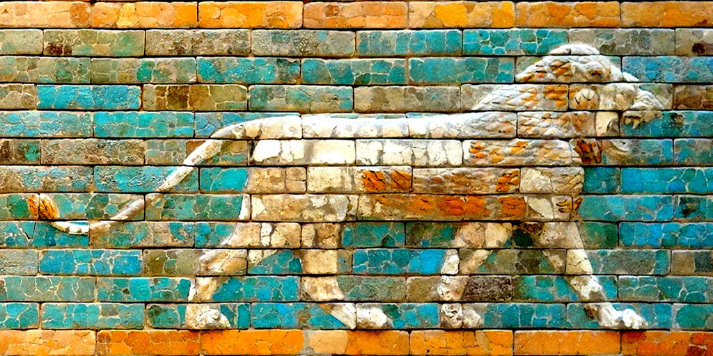
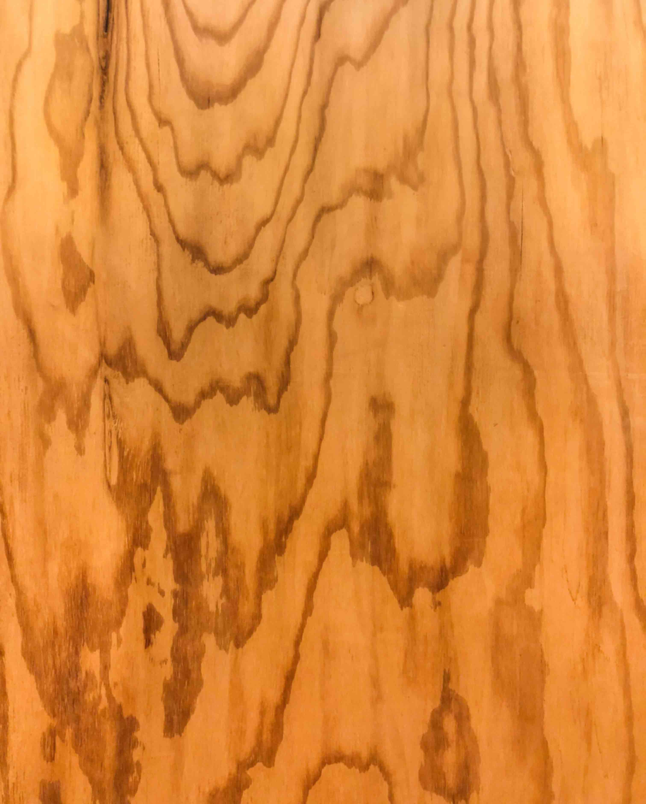

# 纹理


纹理一般是指我们常见的在一些第三方程序中创建的图像，如Photoshop或GIMP。比如我们把这张图片放在立方体上。



<code src="./demo/TexturedCube.tsx"></code>

6个纹理，一个立方体的每个面都有一个，我们只需制作6种材料，并在创建 Mesh 时将它们作为一个数组传递给它们。

<code src="./demo/TexturedCube6Textures.tsx"></code>

并不是所有的几何体类型都支持多种材质。BoxGeometry 和 BoxGeometry 可以使用6种材料，每个面一个。ConeGeometry 和 ConeGeometry 可以使用2种材料，一种用于底部，一种用于侧面。 CylinderGeometry 和 CylinderGeometry 可以使用3种材料，分别是底部、顶部和侧面。对于其他情况，你需要建立或加载自定义几何体和（或）修改纹理坐标。

在其他3D引擎中，如果你想在一个几何体上使用多个图像，使用 纹理图集（Texture Atlas） 更为常见，性能也更高。纹理图集是将多个图像放在一个单一的纹理中，然后使用几何体顶点上的纹理坐标来选择在几何体的每个三角形上使用纹理的哪些部分。


## 加载纹理


### 简单的方法

本文的大部分代码都使用最简单的加载纹理的方法。我们创建一个 TextureLoader ，然后调用它的load方法。 这将返回一个 Texture 对象。

```js
const texture = loader.load('resources/images/flower-1.jpg');
```

**使用这个方法，我们的纹理将是透明的，直到图片被three.js异步加载完成**，这时它将用下载的图片更新纹理。

这有一个很大的好处，就是我们不必等待纹理加载，我们的页面会立即开始渲染。这对于很多用例来说可能都没问题，但如果我们想要的话，我们可以让three.js告诉我们何时纹理已经下载完毕。

### 等待一个纹理加载

为了等待贴图加载，贴图加载器的 load 方法会在贴图加载完成后调用一个回调。回到上面的例子，我们可以在创建Mesh并将其添加到场景之前等待贴图加载，就像这样。


```js
const loader = new THREE.TextureLoader();
loader.load('resources/images/wall.jpg', (texture) => {
  const material = new THREE.MeshBasicMaterial({
    map: texture,
  });
  const cube = new THREE.Mesh(geometry, material);
  scene.add(cube);
  cubes.push(cube);  // 添加到我们要旋转的立方体数组中
});
```

### 等待多个纹理加载

要等到所有纹理都加载完毕，你可以使用 LoadingManager 。创建一个并将其传递给 TextureLoader，然后将其onLoad属性设置为回调。

```diff
+ const loadManager = new THREE.LoadingManager();
const loader = new THREE.TextureLoader(loadManager);

const materials = [
  new THREE.MeshBasicMaterial({map: loader.load('resources/images/flower-1.jpg')}),
  new THREE.MeshBasicMaterial({map: loader.load('resources/images/flower-2.jpg')}),
  new THREE.MeshBasicMaterial({map: loader.load('resources/images/flower-3.jpg')}),
  new THREE.MeshBasicMaterial({map: loader.load('resources/images/flower-4.jpg')}),
  new THREE.MeshBasicMaterial({map: loader.load('resources/images/flower-5.jpg')}),
  new THREE.MeshBasicMaterial({map: loader.load('resources/images/flower-6.jpg')}),
];

+ loadManager.onLoad = () => {
+   const cube = new THREE.Mesh(geometry, materials);
+   scene.add(cube);
+   cubes.push(cube);  // 添加到我们要旋转的立方体数组中
+ };
```

LoadingManager 也有一个 onProgress 属性，我们可以设置为另一个回调来显示进度指示器。

在 onProgress 回调中更新 progressbar 的比例。调用它有如下几个参数：最后加载的项目的URL，目前加载的项目数量，以及加载的项目总数。

```diff
loadManager.onLoad = () => {
+  // 
  const cube = new THREE.Mesh(geometry, materials);
  scene.add(cube);
  cubes.push(cube);  // 添加到我们要旋转的立方体数组中
};
 
+ loadManager.onProgress = (urlOfLastItemLoaded, itemsLoaded, itemsTotal) => {
+   const progress = itemsLoaded / itemsTotal;
+   // do something
+ };
```

<code src="./demo/TexturedCube6TexturesLoading.tsx"></code>

### 从其他源加载纹理
要使用其他服务器上的图片，这些服务器需要发送正确的头文件。如果他们不发送，你就不能在three.js中使用这些图片，并且会得到一个错误。如果你运行提供图片的服务器，请确保它发送正确的头文件。如果你不控制托管图片的服务器，而且它没有发送权限头文件，那么你就不能使用该服务器上的图片。

例如 imgur、flickr 和 github 都会发送头文件，允许你在 three.js 中使用他们服务器上托管的图片，使用 three.js。而其他大多数网站则不允许。


## 内存管理

纹理往往是three.js应用中使用内存最多的部分。重要的是要明白，一般来说，纹理会占用 **宽度 * 高度 * 4 * 1.33** 字节的内存。

注意，这里没有提到任何关于压缩的问题。我可以做一个.jpg的图片，然后把它的压缩率设置的超级高。比如说我在做一个房子的场景。在房子里面有一张桌子，我决定在桌子的顶面放上这个木质的纹理



那张图片只有157k，所以下载起来会比较快，但实际上它的大小是3024×3761像素。按照上面的公式，那就是

```
3024 * 3761 * 4 * 1.33 = 60505764.5
```

在three.js中，这张图片会占用60兆（meg）的内存！。只要几个这样的纹理，你就会用完内存。

我之所以提出这个问题，是因为要知道使用纹理是有隐性成本的。为了让three.js使用纹理，必须把纹理交给GPU，而GPU一般都要求纹理数据不被压缩。

这个例子的寓意在于，**不仅仅要让你的纹理的文件大小小，还得让你的纹理尺寸小**。文件大小决定下载速度快慢。尺寸大小决定占用的内存多少。你应该把它们做得多小，越小越好，而且看起来仍然是你需要的样子。

**JPG vs PNG**

这和普通的HTML差不多，JPG有损压缩，PNG有无损压缩，所以PNG的下载速度一般比较慢。但是，PNG支持透明度。PNG可能也适合作为非图像数据（non-image data）的格式，比如法线图，以及其他种类的非图像图，我们后面会介绍。请记住，在WebGL中JPG使用的内存并不比PNG少。

### 过滤和mips

让我们把这个16x16的纹理应用到一个立方体上。

<code src="./demo/TexturedCubeMinMap.tsx"></code>

让我们把这个立方体材质画得非常小

<code src="./demo/FilterCubeSmall.tsx"></code>


嗯，我想这很难看得清楚。让我们把这个小方块放大

<code src="./demo/FilterCubeSmallLowRes.tsx"></code>

GPU怎么知道小立方体的每一个像素需要使用哪些颜色？如果立方体小到只有1、2个像素呢？

这就是过滤（filtering）的意义所在。

如果是Photoshop，Photoshop会把几乎所有的像素平均在一起，来计算出这1、2个像素的颜色。这将是一个非常缓慢的操作。GPU用mipmaps解决了这个问题。

Mips 是纹理的副本，每一个都是前一个 mip 的一半宽和一半高，其中的像素已经被混合以制作下一个较小的 mip。Mips一直被创建，直到我们得到1x1像素的Mip。对于上面的图片，所有的Mip最终会变成这样的样子


现在，当立方体被画得很小，只有1或2个像素大时，GPU可以选择只用最小或次小级别的mip来决定让小立方体变成什么颜色。

在three.js中，当纹理绘制的尺寸大于其原始尺寸时，或者绘制的尺寸小于其原始尺寸时，你都可以做出相应的处理。

当纹理绘制的尺寸大于其原始尺寸时，你可以将 texture.magFilter 属性设置为 THREE.NearestFilter 或 THREE.LinearFilter 。NearestFilter 意味着只需从原始纹理中选取最接近的一个像素。对于低分辨率的纹理，这给你一个非常像素化的外观，就像Minecraft。

LinearFilter 是指从纹理中选择离我们应该选择颜色的地方最近的4个像素，并根据实际点与4个像素的距离，以适当的比例进行混合。

<code src="./demo/MagFilter.tsx"></code>


为了在绘制的纹理小于其原始尺寸时设置过滤器，你可以将 texture.minFilter 属性设置为下面6个值之一。

* THREE.NearestFilter 同上，在纹理中选择最近的像素。
* THREE.LinearFilter 和上面一样，从纹理中选择4个像素，然后混合它们
* THREE.NearestMipmapNearestFilter 选择合适的mip，然后选择一个像素。
* THREE.NearestMipmapLinearFilter 选择2个mips，从每个mips中选择一个像素，混合这2个像素。
* THREE.LinearMipmapNearestFilter 选择合适的mip，然后选择4个像素并将它们混合。
* THREE.LinearMipmapLinearFilter 选择2个mips，从每个mips中选择4个像素，然后将所有8个像素混合成1个像素。

<code src="./demo/FilterModes.tsx"></code>

需要注意的是，使用 NearestFilter 和 LinearFilter 的左上方和中上方没有使用mips。正因为如此，它们在远处会闪烁，因为GPU是从原始纹理中挑选像素。左边只有一个像素被选取，中间有4个像素被选取并混合，但这还不足以得出一个好的代表颜色。其他4条做得比较好，右下角的LinearMipmapLinearFilter最好。

如果你点击上面的图片，它将在我们上面一直使用的纹理和每一个mip级别都是不同颜色的纹理之间切换。

<code src="./demo/DifferentColoredMips.tsx"></code>

### 重复，偏移，旋转，包裹一个纹理

纹理有重复、偏移和旋转纹理的设置。

默认情况下，three.js中的纹理是不重复的。要设置纹理是否重复，有2个属性，wrapS 用于水平包裹，wrapT 用于垂直包裹。

它们可以被设置为以下其中一个：

* THREE.ClampToEdgeWrapping 每条边上的最后一个像素无限重复。
* THREE.RepeatWrapping 纹理重复
* THREE.MirroredRepeatWrapping 在每次重复时将进行镜像

比如说，要开启两个方向的包裹。

```js
someTexture.wrapS = THREE.RepeatWrapping;
someTexture.wrapT = THREE.RepeatWrapping;
```

重复是用[repeat]重复属性设置的。

```js
const timesToRepeatHorizontally = 4;
const timesToRepeatVertically = 2;
someTexture.repeat.set(timesToRepeatHorizontally, timesToRepeatVertically);
```

纹理的偏移可以通过设置 offset 属性来完成。纹理的偏移是以单位为单位的，其中1个单位=1个纹理大小。换句话说，0 = 没有偏移，1 = 偏移一个完整的纹理数量。

```js
const xOffset = .5;   // offset by half the texture
const yOffset = .25;  // offset by 1/4 the texture
someTexture.offset.set(xOffset, yOffset);
```

通过设置以弧度为单位的 rotation 属性以及用于选择旋转中心的 center 属性，可以设置纹理的旋转。它的默认值是0,0，从左下角开始旋转。像偏移一样，这些单位是以纹理大小为单位的，所以将它们设置为 .5，.5 将会围绕纹理中心旋转。

```js
someTexture.center.set(.5, .5);
someTexture.rotation = THREE.MathUtils.degToRad(45);
```

让我们修改一下上面的示例，来试试这些属性吧

首先，我们要保留一个对纹理的引用，这样我们就可以对它进行操作。

```diff
+ const texture = loader.load('resources/images/wall.jpg');
const material = new THREE.MeshBasicMaterial({
-  map: loader.load('resources/images/wall.jpg')
+  map: texture,
});
```

然后，我们会再次使用 lil-gui 来提供一个简单的界面。

```js
import {GUI} from 'three/addons/libs/lil-gui.module.min.js';
```

正如我们在之前的lil-gui例子中所做的那样，我们将使用一个简单的类来给lil-gui提供一个可以以度数为单位进行操作的对象，但它将以弧度为单位设置该属性。

```js
class DegRadHelper {
  constructor(obj, prop) {
    this.obj = obj;
    this.prop = prop;
  }
  get value() {
    return THREE.MathUtils.radToDeg(this.obj[this.prop]);
  }
  set value(v) {
    this.obj[this.prop] = THREE.MathUtils.degToRad(v);
  }
}
```

我们还需要一个类，将 "123" 这样的字符串转换为 123 这样的数字，因为three.js的枚举设置需要数字，比如 wrapS 和 wrapT，但lil-gui只使用字符串来设置枚举。

```js
class StringToNumberHelper {
  constructor(obj, prop) {
    this.obj = obj;
    this.prop = prop;
  }
  get value() {
    return this.obj[this.prop];
  }
  set value(v) {
    this.obj[this.prop] = parseFloat(v);
  }
}
```

利用这些类，我们可以为上面的设置设置一个简单的GUI。

```js
const wrapModes = {
  'ClampToEdgeWrapping': THREE.ClampToEdgeWrapping,
  'RepeatWrapping': THREE.RepeatWrapping,
  'MirroredRepeatWrapping': THREE.MirroredRepeatWrapping,
};
 
function updateTexture() {
  texture.needsUpdate = true;
}
 
const gui = new GUI();
gui.add(new StringToNumberHelper(texture, 'wrapS'), 'value', wrapModes).name('texture.wrapS').onChange(updateTexture);
gui.add(new StringToNumberHelper(texture, 'wrapT'), 'value', wrapModes).name('texture.wrapT').onChange(updateTexture);
gui.add(texture.repeat, 'x', 0, 5, .01).name('texture.repeat.x');
gui.add(texture.repeat, 'y', 0, 5, .01).name('texture.repeat.y');
gui.add(texture.offset, 'x', -2, 2, .01).name('texture.offset.x');
gui.add(texture.offset, 'y', -2, 2, .01).name('texture.offset.y');
gui.add(texture.center, 'x', -.5, 1.5, .01).name('texture.center.x');
gui.add(texture.center, 'y', -.5, 1.5, .01).name('texture.center.y');
gui.add(new DegRadHelper(texture, 'rotation'), 'value', -360, 360).name('texture.rotation');
```

最后需要注意的是，如果你改变了纹理上的 wrapS 或 wrapT，你还必须设置 texture.needsUpdate，以便three.js知道并应用这些设置。其他的设置会自动应用。

<code src="./demo/TexturedCubeAdjust.tsx"></code>

在某些时候，我们将介绍纹理坐标以及其他9种可应用于材料的纹理类型。


